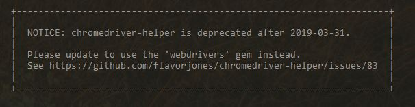
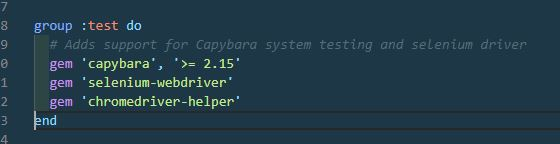

If you're getting this error `Selenium::WebDriver::Error::WebDriverError`, it's probably because you have the chromedriver-helper gem installed.

Or maybe you saw this notice in your terminal or command prompt:

This is what I had in my gemfile in the test section:

Using `gem 'rails', '~> 5.2.4', '>= 5.2.4.1'` and `ruby 2.5.0p0 (2017-12-25 revision 61468)`

So I switched it with this:

Simply by switching out the webdrivers gem for the chromedriver-helper gem, my error message was gone and I could go back to testing.

I ran into this because I hadn't started a new rails project in some time and the updated changes bit me.

Hope this helps!
