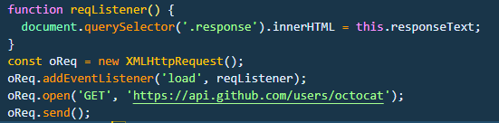
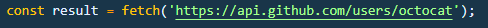
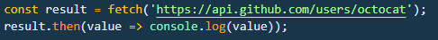
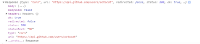
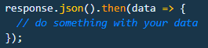
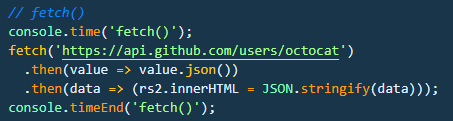
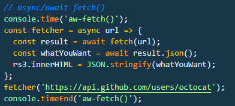
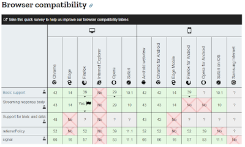

[Here's a quick video of all of that 👇](https://soapbox.wistia.com/videos/VrE8ENWSQ8)

If you’ve sent or received data from somewhere, you’ve likely used an XMLHttpRequest. Or if you’re a jQuery junkie, you’ve used $.ajax({ … }). An XMLHttpRequest looks like this:

Pretty simple, check the console for the time. I ran it 10 times on Chrome and got an average of ~ 0.394ms using [console.time()](https://developer.mozilla.org/en-US/docs/Web/API/Console/time).

## Now let’s look at fetch()
The fetch() method is pretty simple. It only requires the path to the thing you want to fetch. In return, you get a promise that can be resolved to the response, telling you whether it worked or not.

If you were to just do this

and displayed it somehow, you’d get [object Promise]. So after you evaluate the promise, you get the response object.

The response body exposes a [ReadableStream](https://developer.mozilla.org/en-US/docs/Web/API/Response) of the body contents. So how do you get the actual contents? You want [Body.json()](https://developer.mozilla.org/en-US/docs/Web/API/Body/json). The Body is actually a mixin that takes a Response stream, but we’ll talk about mixins another time. So the .json() function returns a promise that evaluates to the actual stuff you want.

~ Mozilla example

So, to chain them all together, you can do something like this:

If you haven’t used ansyc / await patterns, you should start now. You’re probably already pretty familiar with the async part, and the await part is pretty simple to understand at face value too.

Give a promise to await, and it’ll give you the fulfilled value.

When making a function async, you can use the await keyword to pause the execution of the function, pass it a promise (like what’s return from both fetch() and json()), and you’ll get what you want.

So, that chain above would look like this:

One bummer — IE doesn’t support it. But there’s a [polyfill from GitHub](https://github.com/github/fetch) that helps you out.

So, fetch() is pretty great.
