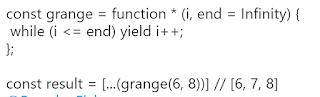
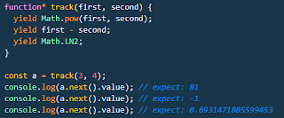
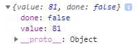
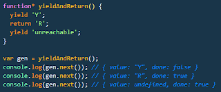

I was reading [Eric Elliot’s tweet](https://twitter.com/_ericelliott/status/1068284745887342592) and saw something I didn’t know.

What was that function * (…)?

Turns out, that syntax defines a [generator function](https://developer.mozilla.org/en-US/docs/Web/JavaScript/Reference/Statements/function*). You can also create a generator function [this way](https://developer.mozilla.org/en-US/docs/Web/JavaScript/Reference/Global_Objects/GeneratorFunction), but the first is shorter, so we’ll stick with that for now.

Instead of returns, the generator functions have yield. And instead of running the whole function at once, you can exit it and return later.

This is what I mean:

We have a generator function called track. Then we assign it with the values 3 and 4 to the variable a. Then we can step through the yields using next() and log the value. This generator function is returning an iterator object. That’s how we can call next() on it. The next() method returns an object that has value and done. Like this:

As you’d guess, done says whether that was the last yield or not, and value is what’s returned from the resolved expression. You can also use [yield*](https://developer.mozilla.org/en-US/docs/Web/JavaScript/Reference/Operators/yield*) func1() to delegate the yield expression to another generator object. If you keep trying next() after the generator has finished, you’ll get:

value: undefined, done: true}

If you want to end the generator, put a return in there and it’ll end.

